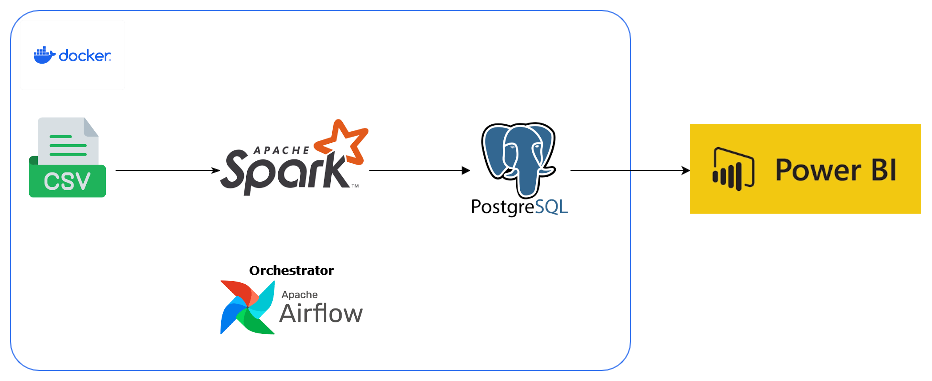

# Fire Incidents Data Pipeline

## Overview
A data pipeline system that processes and analyzes fire incident data to provide valuable insights for emergency response planning and resource allocation.



## Prerequisites
- Docker

## Installation
1. Clone the repository:
```bash
git clone https://github.com/ansharfz/fire-incidents-pipeline.git


2. Run the Docker Compose file:
```bash
docker-compose up -d airflow-init
docker-compose up -d

